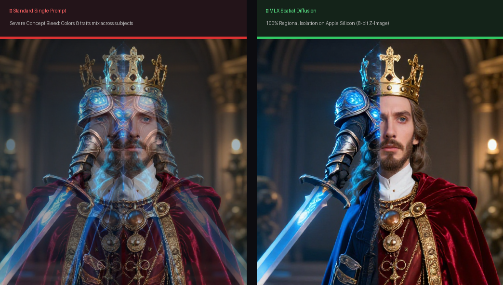
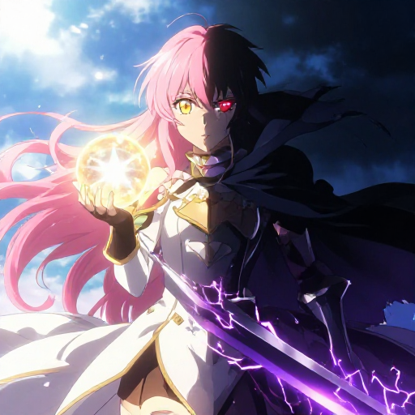
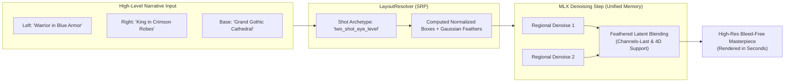

# MLX Spatial Diffusion 🍏🎨

[](LICENSE)
[-black?logo=apple)](https://github.com)
[](https://github.com/ml-explore/mlx)
[](https://python.org)

> **Regional Prompting & MultiDiffusion natively built for Apple Silicon.** Eliminate concept bleed and control complex multi-subject scenes with zero cloud GPU cost and zero PyTorch overhead.

---

## 📸 The Hook: Concept Bleed vs. Spatial Control

<p align="center">
  
</p>

### 🌟 Empirical Results on Apple Silicon Unified Memory
| Celestial Alchemist vs. Abyssal Knight (8-bit) | The Royal Knighting Ceremony (8-bit) |
| :---: | :---: |
|  |  |
| *100% split separation, zero color bleeding* | *Supplicant bowed left, king extending sword right* |

---

## 🚨 The Problem: Concept Bleed in Global Diffusion

Text-to-image models (such as Z-Image, FLUX, and SDXL) process prompt tokens globally. When you describe two or more distinct subjects:
- The text encoder merges tokens across the attention matrix.
- Because cross-attention lacks hard coordinate boundaries, the model suffers from **Concept Bleed**: attributes bleed into neighboring objects (colors cross over, positions swap, and characters amalgamate into multi-limbed hybrids).

### The Mac Dilemma
Previously, Mac users wanting spatial control (e.g. Regional Prompter or Latent Coupling) were forced to run heavy Windows/CUDA-centric tools through PyTorch MPS. On Apple Silicon, PyTorch MPS suffers from:
- Frequent kernel fallbacks to CPU
- Excessive memory consumption and swap thrashing
- Inability to tap into Apple's unified memory bandwidth efficiently

---

## 💡 The Solution: Native MLX MultiDiffusion

**MLX Spatial Diffusion** implements spatial bounding boxes, Gaussian feathered latent blending, and cinematic shot archetypes directly on Apple's **MLX** framework.



### Key Highlights
- **Blazing Fast on Apple Silicon**: Runs 8-bit quantized models in seconds on M2/M3/M4 MacBooks.
- **Zero Concept Bleed**: Independent prompt passes combined through mathematical latent slicing.
- **Gaussian Feathered Blending**: Boundaries between regions are smoothed with native `mx.conv2d` Gaussian kernels to eliminate visible seam lines.
- **Single Responsibility Principle (SRP)**: Includes `LayoutResolver` with 6 built-in cinematic archetypes (`two_shot_eye_level`, `kneeling_ceremony`, `duel_confrontation`, etc.) so you never have to calculate raw bounding box coordinates by hand.
- **Video Pipeline Ready**: Fully integrated with autonomous video generation pipelines like [VidPipe](https://github.com).

---

## ⚡ Quickstart

### 1. Installation

```bash
# Clone the repository
git clone https://github.com/your-username/mlx-spatial-diffusion.git
cd mlx-spatial-diffusion

# Install in editable mode
pip install -e .
```

### 2. Python API

```python
from mlx_spatial_diffusion import SpatialZImageTurbo, LayoutResolver

# 1. Initialize the spatial engine (8-bit quantized Z-Image-Turbo)
model = SpatialZImageTurbo(quantize=8)

# 2. Use LayoutResolver with pre-calibrated cinematic shot archetypes
resolver = LayoutResolver()
regions, base_prompt = resolver.resolve({
    "layout": "two_shot_eye_level",
    "environment": "Grand gothic cathedral with soaring vaulted arches and radiant stained glass",
    "characters_in_scene": {
        "left": "Young knight in shining silver steel plate armor, sapphire mantle",
        "right": "Elder monarch with golden crown, regal crimson velvet robes"
    }
})

# 3. Generate bleed-free masterpiece keyframe
image = model.generate_spatial(
    regions=regions,
    base_prompt=base_prompt,
    seed=42,
    num_inference_steps=4,
)

image.save("warrior_and_king.png")
```

#### Custom Normalized Bounding Boxes:
```python
from mlx_spatial_diffusion import SpatialZImageTurbo, Region

model = SpatialZImageTurbo(quantize=8)

regions = [
    Region(box=[0.15, 0.05, 0.95, 0.48], prompt="Celestial alchemist in radiant pink and gold robes", feather_radius=4),
    Region(box=[0.15, 0.52, 0.95, 0.95], prompt="Abyssal death knight in obsidian black armor with glowing purple runes", feather_radius=4),
]

image = model.generate_spatial(
    regions=regions,
    base_prompt="Floating mystical sanctuary at cosmic twilight",
    seed=42,
)
image.save("custom_spatial.png")
```

### 3. Command Line Interface (CLI)

Generate images directly from your terminal:

```bash
# Generate a two-character scene
mlx-spatial generate \
  --preset two_shot_eye_level \
  --left "Young warrior in glowing blue plate armor" \
  --right "Elder king in rich crimson velvet robes" \
  --env "Grand throne room with radiant stained glass" \
  --output warrior_king.png

# List all available cinematic archetypes
mlx-spatial presets
```

> **Note on Web UI Studio**: An interactive drag-and-drop bounding box web canvas is under active development for **v0.2.0**. Track progress in [docs/ROADMAP.md](docs/ROADMAP.md).

---

## 🎬 Built-in Cinematic Shot Archetypes

| Preset | Composition | Default Geometry |
| :--- | :--- | :--- |
| `two_shot_eye_level` | Balanced dialogue | Left: `[0.15, 0.05, 0.95, 0.48]`, Right: `[0.15, 0.52, 0.95, 0.95]` |
| `kneeling_ceremony` | Supplicant & Ruler | Kneeling: `[0.30, 0.05, 0.98, 0.48]`, Throne: `[0.10, 0.48, 0.95, 0.95]` |
| `duel_confrontation` | Dynamic combat stances | Combatant A: `[0.18, 0.02, 0.95, 0.48]`, Combatant B: `[0.18, 0.52, 0.98, 0.98]` |
| `over_the_shoulder` | Depth layering | Foreground Shoulder: `[0.25, 0.02, 0.98, 0.42]`, Facing Speaker: `[0.15, 0.42, 0.90, 0.95]` |
| `hero_and_sidekick` | Leadership framing | Hero: `[0.10, 0.05, 0.95, 0.60]`, Sidekick: `[0.25, 0.60, 0.90, 0.95]` |
| `left_right_split` | Symmetrical split | Left: `[0.05, 0.05, 0.95, 0.48]`, Right: `[0.05, 0.52, 0.95, 0.95]` |

---

## 📚 Documentation & Technical Reference

- [**System Architecture & Math (`docs/ARCHITECTURE.md`)**](docs/ARCHITECTURE.md): Mathematical formulation of latent slicing, Gaussian feathering, unified memory mechanics, and Single-Pass attention masking.
- [**VidPipe Cinematic Pipeline (`docs/VIDPIPE_CINEMATIC_PIPELINE.md`)**](docs/VIDPIPE_CINEMATIC_PIPELINE.md): End-to-end AI video architecture, token density blueprints, and 3-layer dynamic background composition.
- [**Development Roadmap (`docs/ROADMAP.md`)**](docs/ROADMAP.md): Milestones from Phase 1 prototype to Phase 4 ComfyUI nodes.
- [**Launch Strategy Checklist (`docs/LAUNCH_STRATEGY.md`)**](docs/LAUNCH_STRATEGY.md): Pre-release checklist and social launch templates.

---

## 🧪 Testing

Run the full unit test suite:

```bash
python -m unittest discover tests -v
```

All 18 unit tests cover bounding box validation, Gaussian convolution kernels, multi-channel latent blending, scheduler timesteps, and layout resolution.

---

## 🤝 Contributing

Contributions are welcome! Whether optimizing Metal GPU kernels, adding new diffusion model backends, or building the v0.2.0 Web UI, please check out our [Roadmap](docs/ROADMAP.md) and open an issue or PR.

---

## 📄 License

This project is licensed under the [MIT License](LICENSE).
