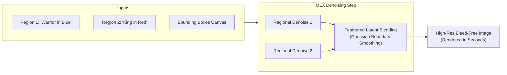

# MLX Spatial Diffusion 🍏🎨

[](LICENSE)
[-black?logo=apple)](https://github.com)
[](https://github.com/ml-explore/mlx)

> **Regional Prompting & MultiDiffusion natively built for Apple Silicon.** Eliminate concept bleed and control complex multi-subject scenes with zero cloud cost and zero PyTorch overhead.

---

## 📸 The Hook: Concept Bleed vs. Spatial Control

| Standard FLUX Generation (Concept Bleed) | MLX Spatial Diffusion (Regional Separation) |
| :---: | :---: |
|  |  |
| *"A warrior in blue armor on left, a king in red robes on right"* $\rightarrow$ **Colors bleed across characters.** | *"Box 1: Warrior in blue armor \| Box 2: King in red robes"* $\rightarrow$ **Precise spatial isolation.** |

---

## 🚨 The Problem: Concept Bleed in Global Diffusion

Text-to-image models (such as FLUX, SDXL, and Z-Image) process prompt tokens globally. When you request multiple distinct subjects:
- The text encoder merges tokens across the attention matrix.
- Because attention lacks hard coordinate boundaries, the model suffers from **Concept Bleed**: attributes bleed into neighboring objects (colors cross over, positions swap, and subjects amalgamate).

### The Mac Dilemma
Previously, Mac users wanting spatial control (e.g. Regional Prompter or Latent Coupling) were forced to run heavy Windows/CUDA-centric tools through PyTorch MPS. On Apple Silicon, PyTorch MPS suffers from:
- Frequent kernel fallbacks to CPU
- Excessive memory consumption and swap thrashing
- Missing 4-bit unified memory optimizations

---

## 💡 The Solution: Native MLX MultiDiffusion

**MLX Spatial Diffusion** implements spatial bounding boxes and multi-prompt denoising directly on Apple's **MLX** framework.



### Key Highlights
- **Blazing Fast on Apple Silicon**: Optimized for unified memory and Metal GPU pipelines.
- **Low Memory Footprint**: Runs 4-bit and 8-bit quantized models (like FLUX.1-schnell) on standard 16GB/18GB MacBooks without OOM.
- **Feathered Blending**: Boundaries between regions are blended with Gaussian latent kernels to eliminate visible seam lines.
- **Interactive Web Canvas**: Launch a local drag-and-drop bounding box editor with one command.

---

## ⚡ Quickstart

### 1. Installation

```bash
# Clone the repository
git clone https://github.com/your-username/mlx-spatial-diffusion.git
cd mlx-spatial-diffusion

# Install dependencies
pip install -e .
```

### 2. Interactive Web UI
Launch the interactive drag-and-drop bounding box studio locally:

```bash
mlx-spatial --ui
```
Open `http://localhost:7860` in Safari/Chrome, draw your regions, type regional prompts, and click **Generate**.

### 3. Python API

```python
from mlx_spatial_diffusion import SpatialPipeline, Region

# Initialize pipeline with 4-bit quantized FLUX.1-schnell
pipeline = SpatialPipeline.from_pretrained("flux-schnell", quantize=4)

# Define regional canvas coordinates (normalized 0.0 - 1.0: ymin, xmin, ymax, xmax)
regions = [
    Region(
        box=[0.0, 0.0, 1.0, 0.5],
        prompt="A fierce warrior in ornate blue glowing armor, holding a sword"
    ),
    Region(
        box=[0.0, 0.5, 1.0, 1.0],
        prompt="A wise king in regal red velvet robes, golden crown"
    ),
]

# Generate image
image = pipeline.generate(
    regions=regions,
    base_prompt="Cinematic fantasy throne room, atmospheric lighting, 8k",
    steps=4,
    seed=42,
)

image.save("output_spatial.png")
```

---

## 📚 Documentation & Project Reference

For deep technical dives and release operations, explore the [`docs/`](docs/) directory:

- [**System Architecture & Math (`docs/ARCHITECTURE.md`)**](docs/ARCHITECTURE.md): Mathematical formulation of latent slicing, Gaussian feathering, and DiT attention behavior.
- [**Development Roadmap (`docs/ROADMAP.md`)**](docs/ROADMAP.md): Milestones from Phase 1 prototype to Phase 4 ComfyUI nodes.
- [**Strategy 3 Pre-Release Guide (`docs/LAUNCH_STRATEGY.md`)**](docs/LAUNCH_STRATEGY.md): Mandatory checklist (15-second visual proof demo, 1-command installer validation, and social launch templates) before public release.

---

## 🤝 Community & Contributing

Contributions are welcome! Whether optimizing Metal kernels, expanding support for new diffusion backends, or improving the Web UI, please check out the [Roadmap](docs/ROADMAP.md) and open an issue or pull request.

---

## 📄 License

This project is licensed under the [MIT License](LICENSE).
