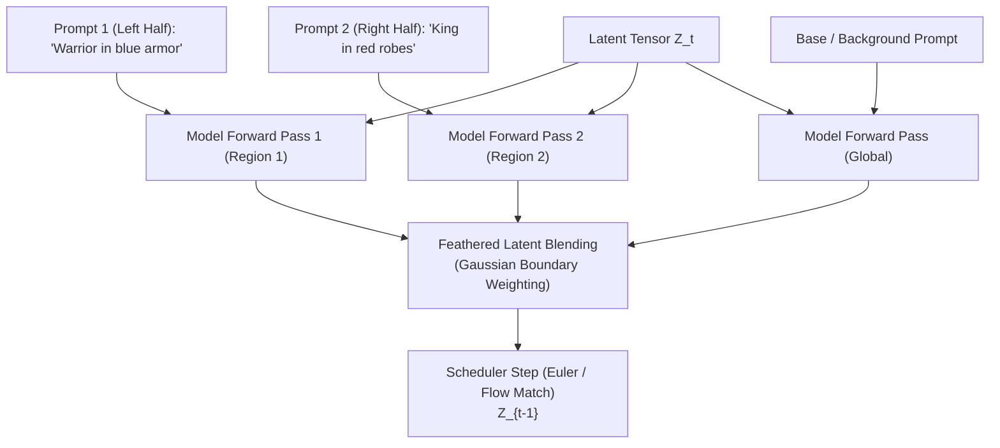

# System Architecture: MLX Spatial Diffusion

This document outlines the technical design, mathematical foundation, and implementation blueprint for bringing native Regional Prompting and MultiDiffusion to Apple Silicon using Apple's MLX array framework.

---

## 1. The Core Problem: Global Attention & Concept Bleed

In standard text-to-image models (e.g., FLUX, SDXL), attention is computed globally across all image tokens and text tokens:

$$\text{Attention}(Q, K, V) = \text{softmax}\left(\frac{QK^T}{\sqrt{d_k}}\right)V$$

When a prompt contains multiple localized subjects—such as *"a warrior in blue armor on the left, a king in red robes on the right"*:
1. Both text concepts share the exact same key-value projection space.
2. In early denoising timesteps ($t \approx T$), spatial representations have not solidified.
3. Attention cross-talk causes color and subject bleed (the warrior ends up in red robes, or the king appears on the left).

---

## 2. MultiDiffusion & Latent Slicing Formulation

To enforce spatial control without retraining the foundation model, we partition the global latent grid $\mathbf{Z} \in \mathbb{R}^{C \times H \times W}$ into $N$ overlapping or distinct spatial regions $\Omega_i$:

$$\mathbf{Z} = \bigcup_{i=1}^N \Omega_i$$

Each region $\Omega_i$ is defined by:
- A spatial mask $M_i(x, y) \in [0, 1]$
- A dedicated regional prompt $P_i$
- A local latent slice $\mathbf{Z}_i = M_i \odot \mathbf{Z}$



### 2.1 Feathered Latent Blending
Direct hard stitching of latent slices creates visible boundary seam artifacts in the decoded pixel image. To ensure seamless transitions:
1. Every mask $M_i$ is smoothed along its boundaries using a 2D Gaussian feathering kernel $G_\sigma$:
   $$\widetilde{M}_i = M_i * G_\sigma$$
2. The blended latent velocity / noise prediction $\hat{\epsilon}_t$ at timestep $t$ is normalized across all regions:
   $$\hat{\epsilon}_t(x, y) = \frac{\sum_{i=1}^N \widetilde{M}_i(x, y) \cdot \epsilon_t^{(i)}(x, y)}{\sum_{i=1}^N \widetilde{M}_i(x, y) + \epsilon_{\text{eps}}}$$
3. The scheduler then computes the single step forward $Z_{t-1} = \text{Step}(Z_t, \hat{\epsilon}_t)$.

---

## 3. Apple Silicon & MLX Optimizations

Running multi-pass regional denoising on standard PyTorch MPS introduces heavy latency and CPU-GPU synchronization stalls. MLX provides distinct advantages:

1. **Unified Memory Architecture (UMA)**
   - No costly PCIe transfers between host and device memory.
   - Text encoder embeddings, regional prompt tokens, and latent grids live in the same unified RAM address space.
2. **Quantized Flow Matching (4-bit & 8-bit)**
   - FLUX.1-schnell and dev can be loaded in 4-bit weights (`mflux` format), occupying $\approx 9.5\text{ GB}$ of RAM.
   - This leaves ample headroom on 16GB, 18GB, 24GB, and 36GB MacBooks for multi-pass batching without paging to swap.
3. **Lazy Evaluation & Graph Compilation**
   - MLX evaluates operations lazily. We structure the multi-region forward passes so MLX's graph compiler can fuse slice and blend operations into optimized Metal kernels.

---

## 4. Module Decomposition

```
mlx_spatial_diffusion/
├── __init__.py
├── api.py                  # High-level entry point (generate_spatial)
├── core/
│   ├── mask.py             # RegionMask & coordinate translators (pixel <-> latent)
│   ├── blending.py         # Gaussian feathering & weighted latent normalization
│   └── sampler.py          # Spatial Euler / Flow Match scheduler loop
├── models/
│   ├── loader.py           # mflux / FLUX model loader & weight quantization
│   └── text_encoder.py     # Multi-prompt batch embedding generator
└── ui/
    ├── app.py              # Local Web UI launcher (Gradio / lightweight canvas)
    └── static/             # Canvas drawing assets
```

---

## 5. FLUX Diffusion Transformer (DiT) vs. UNet Considerations

| Dimension | Classic UNet (SDXL) | Diffusion Transformer (FLUX DiT) | MLX Spatial Approach |
| :--- | :--- | :--- | :--- |
| **Attention Type** | Cross-Attention ($Q_{\text{img}}, K_{\text{text}}$) + Self-Attention | Joint Multi-Modal Attention (MM-DiT) | Multi-pass latent blending initially; Attention Masking in Phase 3 |
| **Coordinate Space** | 8x Downscaled Latents ($64 \times 64$) | 16x Downscaled Latent Patches ($2 \times 2$ patchification) | Exact coordinate alignment accounting for $16\times$ patch strides |
| **Sampling Steps** | 20–30 Euler steps | 4 steps (Schnell) / 20–28 steps (Dev) | Schnell (4 steps) delivers 5–12s total regional generation on Apple Silicon |
