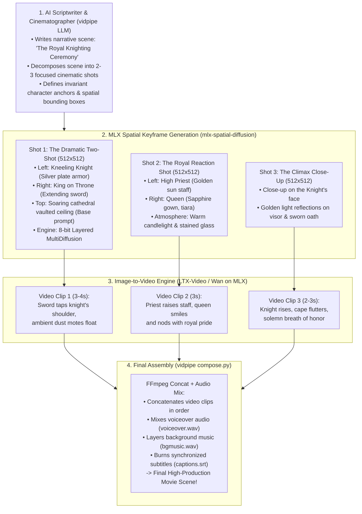
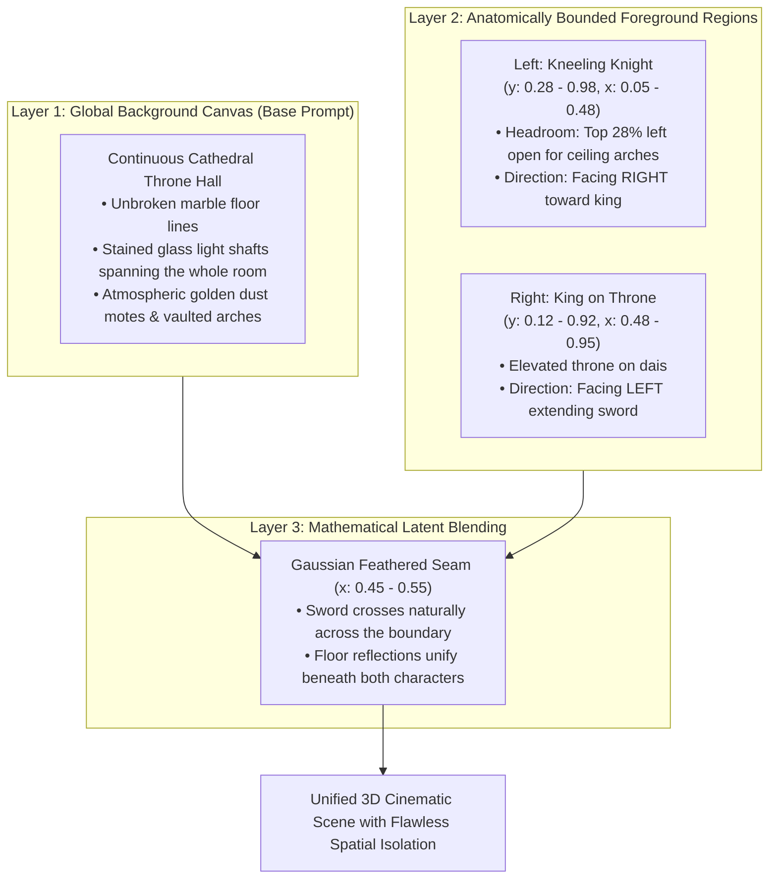
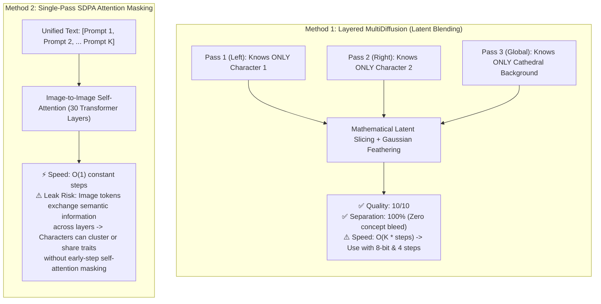
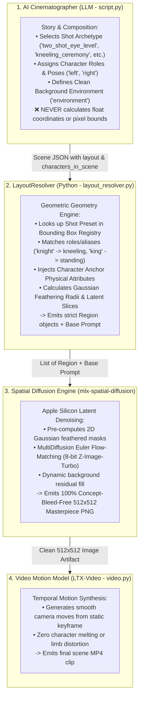

# VidPipe Cinematic Pipeline & Spatial Diffusion Architecture

This document serves as the permanent knowledgebase reference for integrating **`mlx-spatial-diffusion`** into the **`vidpipe`** autonomous AI video production engine on Apple Silicon.

---

## 1. The End-to-End Cinematic Video Pipeline

In professional cinema and high-end anime production, a scene is **never** a single crowded image stretched across 10 seconds of video. Instead, scenes are broken down into complementary cinematic shots (Shot - Reverse - Shot) rendered by spatial diffusion and animated by Image-to-Video (I2V) models.



---

## 2. Dynamic Background & Layered Foreground Engine

To prevent the background from splitting into two disconnected rooms when using multiple regional prompts, the engine uses a **3-Layer Depth Composition Architecture**:



### Mathematical Formulation of Background Residual Fill
At each diffusion step $t$, the blended latent velocity $\hat{\epsilon}_t$ combines the regional character predictions with the global environment:

$$\hat{\epsilon}_t(x, y) = \frac{\sum_{i=1}^N M_i(x, y) \cdot \epsilon_t^{(i)}(x, y) + M_{\text{base}}(x, y) \cdot \epsilon_t^{(\text{base})}(x, y)}{\sum_{i=1}^N M_i(x, y) + M_{\text{base}}(x, y) + \epsilon_{\text{eps}}}$$

Where the effective base mask $M_{\text{base}}(x, y)$ dynamically fills any ceiling headroom or floor areas not occupied by character bounding boxes:

$$M_{\text{base}}(x, y) = \max\left(0.0, \, 1.0 - \sum_{i=1}^N M_i(x, y)\right)$$

---

## 3. Algorithm Tradeoff: MultiDiffusion vs. Single-Pass Attention Masking

Our research and empirical tests identified the critical tradeoffs between the two spatial diffusion mechanisms:



### Summary of Best Practices:
* **For 2-Character Dramatic Interactions**: Use **Method 1 (Layered MultiDiffusion in 8-bit)**. With 4 steps and cache clearing, it guarantees 100% crisp separation (as demonstrated in the Celestial Alchemist and Knight tests).
* **For Wide Background Grids (5+ Elements)**: Use **Method 2 (Single-Pass Attention Masking)** with early-step self-attention windowing to prevent compute explosion.

---

## 4. The Token Real Estate & Resolution Blueprint

Diffusion Transformers process images as discrete patch token grids. For a standard $512 \times 512$ video frame:
* VAE downsamples $8\times \implies 64 \times 64$ latent grid.
* Patch size of $2\times 2 \implies \mathbf{32 \times 32 = 1,024 \text{ tokens in GPU VRAM}}$.

| Layout Configuration | Canvas Size | Tokens per Subject | Visual Outcome |
| :--- | :---: | :---: | :--- |
| **2-Character Dramatic Focus** *(Recommended)* | $512 \times 512$ | **16 tokens wide** ($512$ tokens per character) | **Masterpiece Quality**: Ample resolution for facial features, eyes, armor engravings, and fabric folds. |
| **4-Character Crowded Grid** | $512 \times 512$ | **Only 7–8 tokens wide!** | **Anatomical Breakdown**: Receptive field too small for a human body; characters vanish or melt into blobs. |
| **4-Character Widescreen Sequence** | $1024 \times 576$ | **16–20 tokens wide** ($576$ tokens per character) | **Clean Execution**: Sufficient token space, but requires widescreen video pipeline settings. |

---

---

## 5. Single Responsibility Principle (SRP) System Architecture

To ensure high reliability, zero hallucination of coordinates, and maintainable separation of concerns, the multi-character generation pipeline strictly implements SRP across 4 distinct layers:



---

## 6. Built-in Cinematic Shot Archetype Registry

The `LayoutResolver` provides a curated registry of cinematic shot archetypes:

| Preset Name | Composition | Slots & Bounding Boxes | Typical Use Cases |
| :--- | :--- | :--- | :--- |
| `two_shot_eye_level` | Balanced dialogue | **Left**: `[0.15, 0.05, 0.95, 0.48]`<br>**Right**: `[0.15, 0.52, 0.95, 0.95]` | Dialogue scenes, discussions, consultations |
| `kneeling_ceremony` | Dramatic vertical contrast | **Kneeling**: `[0.30, 0.05, 0.98, 0.48]`<br>**Standing/Throne**: `[0.10, 0.48, 0.95, 0.95]` | Knighting ceremonies, blessings, pledging loyalty, surrenders |
| `duel_confrontation` | Dynamic combat stances | **Left**: `[0.18, 0.02, 0.95, 0.48]`<br>**Right**: `[0.18, 0.52, 0.98, 0.98]` | Sword duels, martial arts showdowns, intense face-offs |
| `over_the_shoulder` | Foreground depth layering | **Foreground**: `[0.25, 0.02, 0.98, 0.42]`<br>**Focal**: `[0.15, 0.42, 0.90, 0.95]` | Intimate dialogues, secret confessions, dramatic revelations |
| `hero_and_sidekick` | Leadership framing | **Hero**: `[0.10, 0.05, 0.95, 0.60]`<br>**Sidekick**: `[0.25, 0.60, 0.90, 0.95]` | Quest departures, dynamic duos, detective and partner |
| `left_right_split` | Symmetrical split-screen | **Left**: `[0.05, 0.05, 0.95, 0.48]`<br>**Right**: `[0.05, 0.52, 0.95, 0.95]` | Parallel actions, rivalries, telepathic connections |

---

## 7. Cinematographer Output Schema in `script.json`

For multi-character scenes, the cinematographer outputs standard JSON:

```json
{
  "id": "scene_01",
  "beat": "hook",
  "duration_sec": 5,
  "voiceover_text": "On the holy plains of Kurukshetra, Arjuna collapsed before his divine charioteer.",
  "layout": "kneeling_ceremony",
  "environment": "Ancient dusty battlefield of Kurukshetra at sunset with dramatic god-rays cutting through war smoke",
  "characters_in_scene": {
    "knight": "Arjuna dropping to both knees in despair, lowered golden Gandiva bow, trembling hands",
    "king": "Lord Krishna standing serenely atop the golden chariot, yellow pitambar silk fluttering in the wind, reassuring smile"
  },
  "visual_description": "Arjuna kneeling in despair before Lord Krishna on the golden chariot at sunset",
  "shot_size": "medium",
  "color_mood": "Warm sunset amber, burning orange, deep indigo shadows",
  "motion_description": "slow_zoom_in",
  "motion_intensity": "low_motion"
}
```

The `LayoutResolver` parses this, injects the root character anchor definitions (`script["characters"]["Arjuna"]` and `script["characters"]["Krishna"]`), scales coordinates, and dispatches directly to `SpatialZImageTurbo`.
